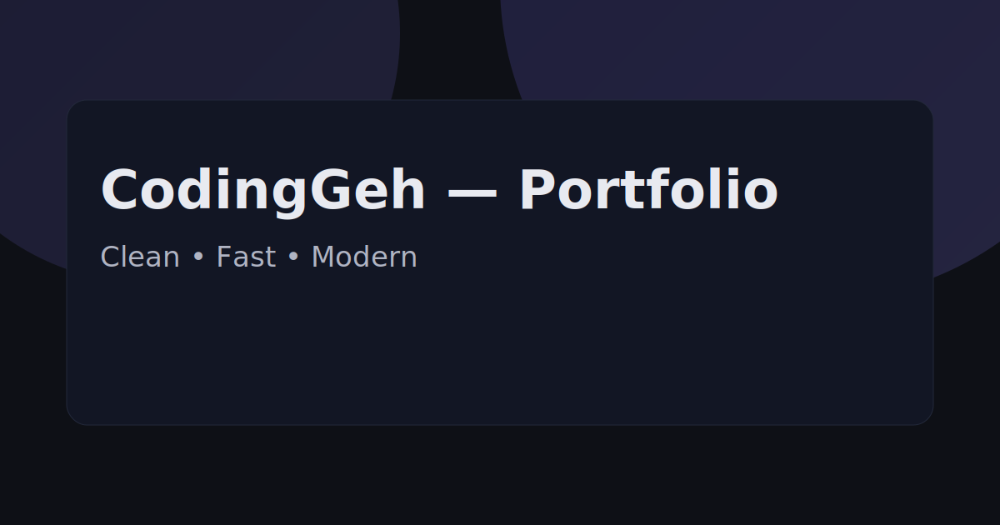

# 🌐 Sample Portfolio

<div align="center">
  
  <br>
  <strong>Modern Static Portfolio Website with SEO Optimization</strong>
  <br>
  <em>Built with ❤️ by CodingGeh</em>
</div>

## 🎬 Demo

<div align="center">
  
</div>

<div align="center">
  <a href="https://coding-geh.github.io/sample-portofolio/">
    
  </a>
  <a href="https://github.com/Coding-Geh/sample-portofolio/stargazers">
    
  </a>
  <a href="https://github.com/Coding-Geh/sample-portofolio/network">
    
  </a>
</div>

<div align="center">
  <a href="#about">About</a> •
  <a href="#features">Features</a> •
  <a href="#screenshots">Screenshots</a> •
  <a href="#tech-stack">Tech Stack</a> •
  <a href="#getting-started">Getting Started</a> •
  <a href="#deployment">Deployment</a>
</div>

---

<div align="center">
  
  
  
  
  
</div>

## 🎯 Project Goal & Learning Journey

This **Sample Portfolio** project was built not just as a portfolio piece, but as a challenge to conquer specific technical hurdles:

* **Main Goal:** Building a modern, SEO-optimized static portfolio website that ranks well on Google and showcases professional web development skills.
* **Technical Challenge:** Creating a fully responsive, accessible, and performant website using only HTML, CSS, and JavaScript while implementing advanced SEO techniques and modern UI/UX patterns.
* **What We Learned:** Advanced SEO implementation, modern CSS techniques, and creating professional-grade static websites that compete with modern frameworks.

## 📋 About

This is a **SAMPLE PORTFOLIO TEMPLATE** created by [CodingGeh](https://github.com/Coding-Geh) to showcase:

- Modern web development skills
- SEO optimization techniques
- Responsive design principles
- Accessibility best practices
- Performance optimization
- Clean, maintainable code structure

## ✨ Features

- 🎨 **Modern UI/UX** - Clean, professional design with smooth animations
- 📱 **Fully Responsive** - Perfect on all devices and screen sizes
- 🌐 **Internationalization** - Multi-language support (EN/ID) with auto-detection
- 🌙 **Dark Mode** - Toggle between light and dark themes
- 🔍 **SEO Optimized** - Meta tags, structured data, sitemap, robots.txt
- ⚡ **Performance** - Fast loading with optimized assets
- ♿ **Accessible** - WCAG compliant with keyboard navigation
- 📊 **Analytics Ready** - Easy integration with Google Analytics
- 🔧 **Modular Code** - Clean, maintainable HTML, CSS, and JavaScript

## 📸 Screenshots

<div align="center">
  <table>
    <tr>
      <td></td>
      <td></td>
      <td></td>
    </tr>
  </table>
</div>

## 🛠️ Tech Stack

### Frontend
- **HTML5** - Semantic markup with accessibility features
- **CSS3** - Modern CSS with Grid, Flexbox, and custom properties
- **JavaScript (ES6+)** - Vanilla JS with modern features
- **CSS Variables** - Dynamic theming and customization

### SEO & Performance
- **Meta Tags** - Comprehensive SEO meta tags
- **Structured Data** - JSON-LD for rich snippets
- **Sitemap** - XML sitemap for search engines
- **Robots.txt** - Search engine crawling instructions
- **Open Graph** - Social media sharing optimization

### Development Tools
- **Git** - Version control with conventional commits
- **GitHub Pages** - Free hosting and deployment
- **GitHub Actions** - Automated deployment workflow

## 🏗️ Architecture

```
sample-portofolio/
├── index.html              # Home page
├── about.html              # About page
├── projects.html           # Projects page
├── contact.html            # Contact page
├── styles.css              # Main stylesheet
├── script.js               # Main JavaScript
├── og-image.svg            # Open Graph image
├── robots.txt              # Search engine instructions
├── sitemap.xml             # Site structure for SEO
├── .github/
│   └── workflows/
│       └── pages.yml       # GitHub Pages deployment
├── .nojekyll               # Disable Jekyll processing
└── LICENSE                 # MIT License
```

**Key Features:**
- **Semantic HTML** - Proper document structure
- **CSS Grid & Flexbox** - Modern layout techniques
- **CSS Custom Properties** - Dynamic theming
- **Intersection Observer** - Scroll-based animations
- **Local Storage** - Theme and language persistence

## 🚀 Getting Started

### Prerequisites
- Modern web browser
- Git
- GitHub account (for deployment)

### Installation
```bash
# Clone the repository
git clone https://github.com/Coding-Geh/sample-portofolio.git

# Navigate to project directory
cd sample-portofolio

# Open in your browser
open index.html
```

### Local Development
```bash
# Start a local server (optional)
python -m http.server 8000
# or
npx serve .

# Open http://localhost:8000
```

## 📥 Deployment

### GitHub Pages (Recommended)
1. Fork this repository
2. Go to Settings > Pages
3. Select source: "Deploy from a branch"
4. Choose branch: `main`
5. Your site will be available at: `https://[username].github.io/sample-portofolio/`

### Manual Deployment
```bash
# Build and deploy to any static hosting
# All files are ready for deployment
```

## 🎯 SEO Features

### Meta Tags
- Title and description optimization
- Open Graph tags for social sharing
- Twitter Card support
- Canonical URLs
- Hreflang for internationalization

### Structured Data
- Person schema for portfolio owner
- Website schema for site information
- BreadcrumbList for navigation
- FAQPage for common questions

### Technical SEO
- XML sitemap
- Robots.txt
- Fast loading times
- Mobile-friendly design
- Accessible markup

## 🌍 Internationalization

### Supported Languages
- **English (en)** - Default language
- **Indonesian (id)** - Secondary language

### Features
- Auto-detection based on browser language
- Language toggle with localStorage persistence
- URL parameter support (`?lang=en|id`)
- Hreflang meta tags for SEO

## 📱 Responsive Design

### Breakpoints
- **Mobile**: < 768px
- **Tablet**: 768px - 1024px
- **Desktop**: > 1024px

### Features
- Mobile-first approach
- Flexible grid system
- Touch-friendly navigation
- Optimized typography scaling

## 🎨 Customization

### Colors & Themes
```css
:root {
  --primary: #6c5ce7;
  --surface: #ffffff;
  --text: #1a1a1a;
  /* Customize these variables */
}
```

### Content
- Update `index.html` for main content
- Modify `script.js` for translations
- Customize `styles.css` for styling

## 📊 Performance Metrics

- **Page Size**: < 50KB
- **Load Time**: < 2 seconds
- **Lighthouse Score**: 95+ (Performance, Accessibility, SEO, Best Practices)
- **Core Web Vitals**: All green

## 🔄 Changelog

#### v1.0.0 (2024-01-15)
- ✨ Initial release
- 🎨 Modern responsive design
- 🔍 Complete SEO optimization
- 🌐 Internationalization support
- 🌙 Dark mode toggle
- 📱 Mobile-first approach

## 🤝 Contributing

1. Fork the repository
2. Create your feature branch (`git checkout -b feature/AmazingFeature`)
3. Commit your changes (`git commit -m 'Add some AmazingFeature'`)
4. Push to the branch (`git push origin feature/AmazingFeature`)
5. Open a Pull Request

## 👥 About CodingGeh

**CodingGeh** is a dynamic development duo focused on creating high-quality web applications with modern technologies and best practices. We believe in building solutions that are not only functional but also elegant and user-friendly.

### Our Expertise
- **Frontend Development**: HTML5, CSS3, JavaScript, React, Vue
- **Backend Development**: Django, Laravel, Go, Node.js, Rust
- **UI/UX Design**: Modern design systems, responsive layouts
- **SEO & Performance**: Search engine optimization, web vitals
- **DevOps**: CI/CD, Docker, Cloud Deployment

### Connect With Us
<div align="center">
  <a href="https://github.com/Coding-Geh">
    
  </a>
  <a href="https://codinggeh.dev">
    
  </a>
  <a href="mailto:hello@codinggeh.dev">
    
  </a>
</div>

### 💼 Looking for a Developer?
<div align="center">
  <p>Impressed with the design and code quality in this project? We can bring the same level of expertise to your project.</p>
  <p><strong>We're available for freelance projects and full-time opportunities!</strong></p>
  <a href="mailto:hello@codinggeh.dev">
    
  </a>
</div>

## 📄 License

This project is licensed under the MIT License - see the [LICENSE](LICENSE) file for details.

---

<div align="center">
  <strong>Made with ❤️ by CodingGeh</strong>
  <br>
  <em>Building the future, one website at a time</em>
</div>
