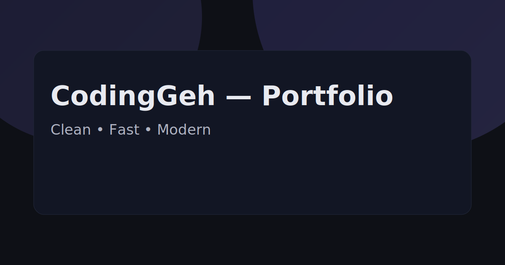

# 🌐 Sample Portfolio

<div align="center">
  
  <br>
  <strong>Website Portfolio Statis Modern dengan Optimasi SEO</strong>
  <br>
  <em>Dibuat dengan ❤️ oleh CodingGeh</em>
</div>

## 🎬 Demo

<div align="center">
  
</div>

<div align="center">
  <a href="https://coding-geh.github.io/sample-portofolio/">
    
  </a>
  <a href="https://github.com/Coding-Geh/sample-portofolio/stargazers">
    
  </a>
  <a href="https://github.com/Coding-Geh/sample-portofolio/network">
    
  </a>
</div>

<div align="center">
  <a href="#tentang">Tentang</a> •
  <a href="#fitur">Fitur</a> •
  <a href="#screenshot">Screenshot</a> •
  <a href="#teknologi">Teknologi</a> •
  <a href="#memulai">Memulai</a> •
  <a href="#deployment">Deployment</a>
</div>

---

<div align="center">
  
  
  
  
  
</div>

## 🎯 Tujuan Proyek & Perjalanan Belajar

Proyek **Sample Portfolio** ini dibangun bukan hanya sebagai portofolio, tetapi sebagai tantangan untuk menaklukkan hambatan teknis tertentu:

* **Tujuan Utama:** Membangun website portfolio statis modern yang dioptimasi SEO dan dapat meraih peringkat tinggi di Google serta menampilkan keterampilan pengembangan web profesional.
* **Tantangan Teknis:** Menciptakan website yang sepenuhnya responsif, dapat diakses, dan berperforma tinggi menggunakan hanya HTML, CSS, dan JavaScript sambil mengimplementasikan teknik SEO lanjutan dan pola UI/UX modern.
* **Yang Kami Pelajari:** Implementasi SEO lanjutan, teknik CSS modern, dan menciptakan website statis tingkat profesional yang dapat bersaing dengan framework modern.

## 📋 Tentang

Ini adalah **TEMPLATE PORTFOLIO SAMPEL** yang dibuat oleh [CodingGeh](https://github.com/Coding-Geh) untuk menampilkan:

- Keterampilan pengembangan web modern
- Teknik optimasi SEO
- Prinsip desain responsif
- Praktik terbaik aksesibilitas
- Optimasi performa
- Struktur kode yang bersih dan mudah dipelihara

## ✨ Fitur

- 🎨 **UI/UX Modern** - Desain bersih dan profesional dengan animasi yang mulus
- 📱 **Sepenuhnya Responsif** - Sempurna di semua perangkat dan ukuran layar
- 🌐 **Internasionalisasi** - Dukungan multi-bahasa (ID/EN) dengan deteksi otomatis
- 🌙 **Mode Gelap** - Toggle antara tema terang dan gelap
- 🔍 **Dioptimasi SEO** - Meta tag, structured data, sitemap, robots.txt
- ⚡ **Performa** - Loading cepat dengan aset yang dioptimasi
- ♿ **Dapat Diakses** - Sesuai WCAG dengan navigasi keyboard
- 📊 **Siap Analytics** - Integrasi mudah dengan Google Analytics
- 🔧 **Kode Modular** - HTML, CSS, dan JavaScript yang bersih dan mudah dipelihara

## 📸 Screenshot

<div align="center">
  <table>
    <tr>
      <td></td>
      <td></td>
      <td></td>
    </tr>
  </table>
</div>

## 🛠️ Teknologi

### Frontend
- **HTML5** - Markup semantik dengan fitur aksesibilitas
- **CSS3** - CSS modern dengan Grid, Flexbox, dan custom properties
- **JavaScript (ES6+)** - Vanilla JS dengan fitur modern
- **CSS Variables** - Tema dinamis dan kustomisasi

### SEO & Performa
- **Meta Tags** - Meta tag SEO yang komprehensif
- **Structured Data** - JSON-LD untuk rich snippets
- **Sitemap** - XML sitemap untuk mesin pencari
- **Robots.txt** - Instruksi crawling mesin pencari
- **Open Graph** - Optimasi berbagi media sosial

### Alat Pengembangan
- **Git** - Version control dengan conventional commits
- **GitHub Pages** - Hosting dan deployment gratis
- **GitHub Actions** - Workflow deployment otomatis

## 🏗️ Arsitektur

```
sample-portofolio/
├── index.html              # Halaman utama
├── about.html              # Halaman tentang
├── projects.html           # Halaman proyek
├── contact.html            # Halaman kontak
├── styles.css              # Stylesheet utama
├── script.js               # JavaScript utama
├── og-image.svg            # Gambar Open Graph
├── robots.txt              # Instruksi mesin pencari
├── sitemap.xml             # Struktur situs untuk SEO
├── .github/
│   └── workflows/
│       └── pages.yml       # Deployment GitHub Pages
├── .nojekyll               # Nonaktifkan pemrosesan Jekyll
└── LICENSE                 # Lisensi MIT
```

**Fitur Utama:**
- **HTML Semantik** - Struktur dokumen yang tepat
- **CSS Grid & Flexbox** - Teknik layout modern
- **CSS Custom Properties** - Tema dinamis
- **Intersection Observer** - Animasi berbasis scroll
- **Local Storage** - Penyimpanan tema dan bahasa

## 🚀 Memulai

### Prasyarat
- Browser web modern
- Git
- Akun GitHub (untuk deployment)

### Instalasi
```bash
# Clone repository
git clone https://github.com/Coding-Geh/sample-portofolio.git

# Masuk ke direktori proyek
cd sample-portofolio

# Buka di browser
open index.html
```

### Pengembangan Lokal
```bash
# Mulai server lokal (opsional)
python -m http.server 8000
# atau
npx serve .

# Buka http://localhost:8000
```

## 📥 Deployment

### GitHub Pages (Direkomendasikan)
1. Fork repository ini
2. Buka Settings > Pages
3. Pilih source: "Deploy from a branch"
4. Pilih branch: `main`
5. Situs Anda akan tersedia di: `https://[username].github.io/sample-portofolio/`

### Deployment Manual
```bash
# Build dan deploy ke hosting statis apapun
# Semua file siap untuk deployment
```

## 🎯 Fitur SEO

### Meta Tags
- Optimasi judul dan deskripsi
- Tag Open Graph untuk berbagi media sosial
- Dukungan Twitter Card
- URL kanonik
- Hreflang untuk internasionalisasi

### Structured Data
- Schema Person untuk pemilik portfolio
- Schema Website untuk informasi situs
- BreadcrumbList untuk navigasi
- FAQPage untuk pertanyaan umum

### SEO Teknis
- XML sitemap
- Robots.txt
- Waktu loading cepat
- Desain ramah mobile
- Markup yang dapat diakses

## 🌍 Internasionalisasi

### Bahasa yang Didukung
- **Indonesia (id)** - Bahasa default
- **Inggris (en)** - Bahasa sekunder

### Fitur
- Deteksi otomatis berdasarkan bahasa browser
- Toggle bahasa dengan penyimpanan localStorage
- Dukungan parameter URL (`?lang=id|en`)
- Meta tag hreflang untuk SEO

## 📱 Desain Responsif

### Breakpoint
- **Mobile**: < 768px
- **Tablet**: 768px - 1024px
- **Desktop**: > 1024px

### Fitur
- Pendekatan mobile-first
- Sistem grid yang fleksibel
- Navigasi ramah sentuh
- Skala tipografi yang dioptimasi

## 🎨 Kustomisasi

### Warna & Tema
```css
:root {
  --primary: #6c5ce7;
  --surface: #ffffff;
  --text: #1a1a1a;
  /* Kustomisasi variabel ini */
}
```

### Konten
- Update `index.html` untuk konten utama
- Modifikasi `script.js` untuk terjemahan
- Kustomisasi `styles.css` untuk styling

## 📊 Metrik Performa

- **Ukuran Halaman**: < 50KB
- **Waktu Loading**: < 2 detik
- **Skor Lighthouse**: 95+ (Performance, Accessibility, SEO, Best Practices)
- **Core Web Vitals**: Semua hijau

## 🔄 Changelog

#### v1.0.0 (15-01-2024)
- ✨ Rilis awal
- 🎨 Desain responsif modern
- 🔍 Optimasi SEO lengkap
- 🌐 Dukungan internasionalisasi
- 🌙 Toggle mode gelap
- 📱 Pendekatan mobile-first

## 🤝 Kontribusi

1. Fork repository
2. Buat branch fitur Anda (`git checkout -b feature/FiturMenakjubkan`)
3. Commit perubahan Anda (`git commit -m 'Tambah beberapa FiturMenakjubkan'`)
4. Push ke branch (`git push origin feature/FiturMenakjubkan`)
5. Buka Pull Request

## 👥 Tentang CodingGeh

**CodingGeh** adalah duo developer yang dinamis dengan fokus pada pembuatan aplikasi web berkualitas tinggi menggunakan teknologi modern dan praktik terbaik. Kami percaya dalam membangun solusi yang tidak hanya fungsional, tetapi juga elegan dan mudah digunakan.

### Keahlian Kami
- **Pengembangan Frontend**: HTML5, CSS3, JavaScript, React, Vue
- **Pengembangan Backend**: Django, Laravel, Go, Node.js, Rust
- **Desain UI/UX**: Sistem desain modern, layout responsif
- **SEO & Performa**: Optimasi mesin pencari, web vitals
- **DevOps**: CI/CD, Docker, Cloud Deployment

### Hubungi Kami
<div align="center">
  <a href="https://github.com/Coding-Geh">
    
  </a>
  <a href="https://codinggeh.dev">
    
  </a>
  <a href="mailto:hello@codinggeh.dev">
    
  </a>
</div>

### 💼 Mencari Developer?
<div align="center">
  <p>Terkesan dengan desain dan kualitas kode di proyek ini? Kami bisa membawa level keahlian yang sama untuk proyek Anda.</p>
  <p><strong>Kami siap untuk proyek freelance dan kesempatan kerja full-time!</strong></p>
  <a href="mailto:hello@codinggeh.dev">
    
  </a>
</div>

## 📄 Lisensi

Proyek ini dilisensikan di bawah Lisensi MIT - lihat file [LICENSE](LICENSE) untuk detailnya.

---

<div align="center">
  <strong>Dibuat dengan ❤️ oleh CodingGeh</strong>
  <br>
  <em>Membangun masa depan, satu website pada satu waktu</em>
</div>
